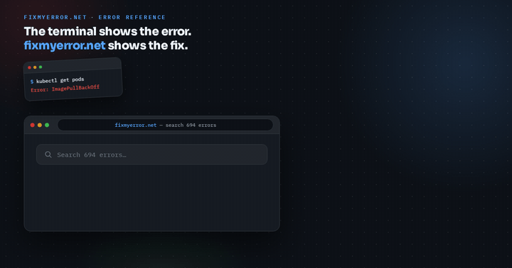

# fixmyerror.net

A searchable reference of **731 developer and infrastructure error messages**, each with a
plain-English explanation, a copy-paste fix, and a link to the authoritative documentation,
across **56 categories** from HTTP status codes and TLS to Kubernetes, databases, AI/LLM APIs,
and every mainstream language runtime.

Live at **<https://fixmyerror.net>**.



## How the site is put together

The site is entirely static and deploys to S3 as a plain file sync. There is no runtime, no
database and no third-party JavaScript.

| URL | What it is |
| --- | --- |
| `/` | The search app. Loads the whole dataset and searches it client-side with Fuse.js. |
| `/errors/<id>.html` | One indexable page per error: explanation, fix, category debugging guide, related errors, sources. |
| `/categories/<slug>.html` | One hub page per category, with an authored guide to debugging that class of error. |
| `/categories.html` | Directory of all 56 categories. |
| `/all-errors.html` | Full A-Z index of every error. |
| `/about.html` | How entries are written and how to use the site. |
| `/sitemap.xml`, `/feed.xml` | Crawl and subscription surfaces, both generated. |

Every error used to live only behind a URL fragment (`/#some-error`), which search engines
collapse into the homepage, so the site had one indexable URL for hundreds of pieces of
content. The generator exists to give each entry a real page.

## Working on it

```bash
npm install        # dev dependencies (jsdom, for the tests)
npm run check      # build + validate + test, run this before committing
```

Individual steps:

```bash
npm run build      # regenerate every page, the dataset, the sitemap and the feed
npm run validate   # data integrity, broken links, duplicate titles/canonicals, JSON-LD
npm test           # behavioural tests against the app and the generated pages
npm run og         # regenerate og-image.png (needs Python + Pillow)
```

Preview locally with any static server:

```bash
python3 -m http.server 8000
```

## Source of truth

Content lives in two files. Everything else in the repository root is generated from them
and committed, because deployment is a plain file sync.

### `data/errors.json`

```jsonc
{
  "id": "kebab-case-id",              // becomes /errors/<id>.html, must be unique
  "title": "The literal error text",  // what people paste into a search engine
  "category": "Kubernetes",           // must have a guide in data/categories.json
  "explanation": "What the message actually means, and why it happens.",
  "fix_snippet": "commands or config, \n-separated",
  "fix_snippet_windows": "optional; renders a Linux/Windows tab pair",
  "sources": ["https://…"],           // HTTPS only; primary documentation, not blog posts
  "dateAdded": "2026-08-28"           // drives the New badge and the RSS feed
}
```

### `data/categories.json`

One authored guide per category: the tagline, an introduction to that class of error, the
debugging steps that apply to all of them, and the tools worth reaching for. This is what
makes the category hubs and error pages worth reading rather than a list of commands.

## Adding an error

1. Add an entry to `data/errors.json` with today's date in `dateAdded`.
2. If it introduces a new category, add a guide for it in `data/categories.json`.
3. Run `npm run check`. It will refuse anything with a duplicate id or title, a non-HTTPS
   source, a category with no guide, or a broken internal link.
4. Commit the generated output alongside the data change.

## Contributing

Corrections are welcome, particularly for entries that have gone stale. Email
[alex@slash-root.com](mailto:alex@slash-root.com) with the error title and what should change.

New entries are most useful with the exact message text, a reproducible cause, and a link to
primary documentation rather than a blog post.
